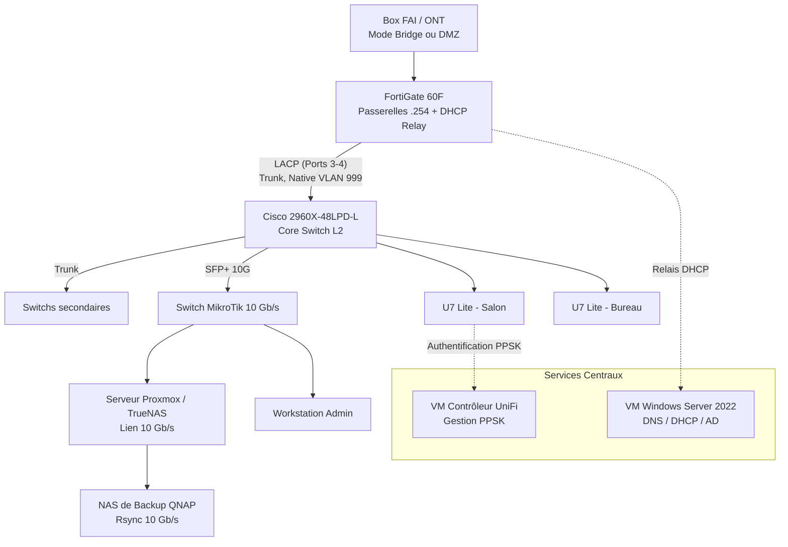

# Architecture et Topologie Réseau

## Vue d'ensemble

Le réseau est conçu autour d'une séparation claire des rôles :
* **Niveau 3 (Routage et Sécurité) :** Assuré par un Fortinet FortiGate 60F. C'est lui qui porte les passerelles des VLAN et filtre le trafic.
* **Niveau 2 (Commutation) :** Un Cisco Catalyst 2960X centralise la distribution. Il est relié au FortiGate via un agrégat de liens (LACP) pour la redondance et le débit.
* **Services de base :** Une VM Windows Server 2022 centralise le DHCP et le DNS. Le FortiGate relaie les requêtes DHCP (DHCP Relay) vers cette VM.
* **Accès Wi-Fi :** Des bornes Ubiquiti U7 Lite diffusent deux SSID maximum. L'affectation dans le bon VLAN se fait via PPSK (Private Pre-Shared Key).

## Diagramme logique

## Choix techniques majeurs

1. **Abandon du VLAN 1 non tagué :** Le trafic de données est basculé sur des VLAN dédiés. Pour éviter les conflits d'interface sur le port-channel Cisco, un VLAN natif fictif (ex: 999) est configuré.
2. **Le VLAN "Merdouille" (ID 1000) :** Un réseau de transition pour accueillir les équipements de l'ancien LAN plat le temps de les reconfigurer, évitant ainsi une coupure brutale.
3. **MDNS Controlé :** Au lieu de tout autoriser, le protocole multicast (nécessaire pour Spotify Connect ou Apple AirPlay) est géré par des règles explicites sur le FortiGate.